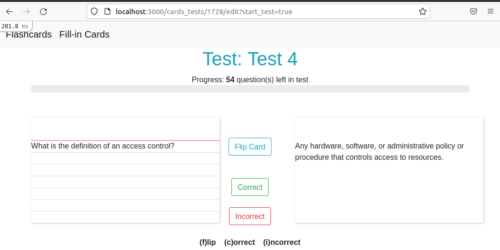
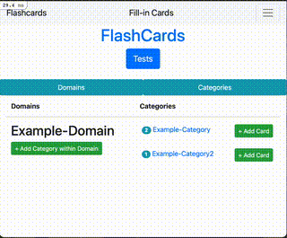
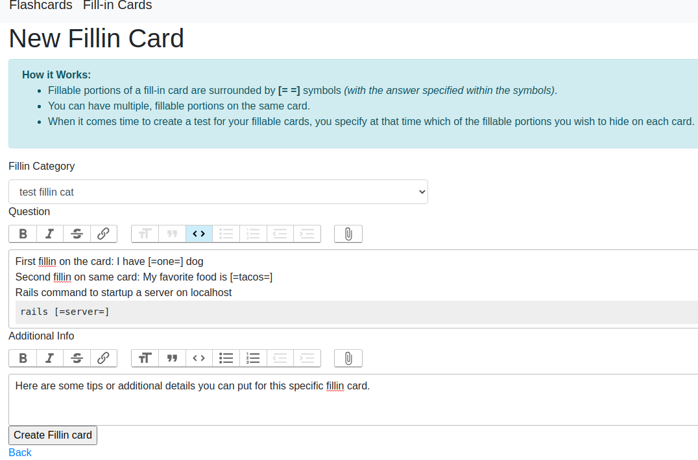
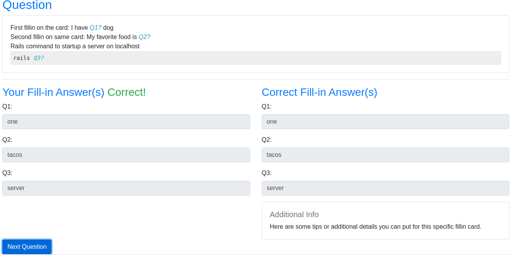
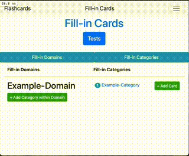
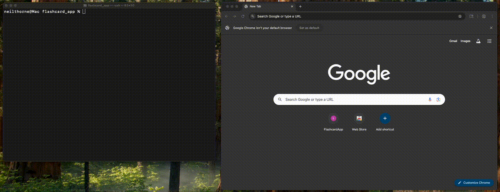

# Welcome to the Flashcard App

## Introduction
This flashcard app includes a number of useful features, including:
- Create both tradaitional-looking flashcards, as well as interactive fill-in flashcards.
- Add images to your flashcards
- Easily create flashcard tests.
- Randomize the flashcard order in your tests
- Progress bar during flashcard tests
- Option to use hotkeys during tests instead of mouse
- Review your test results
- Quickly create new tests that combine previous tests, or create tests that include cards that were answered incorrectly.  

### Traditional Flashcards

 

 
 

### Fill-in Flashcards

 

 

## Getting Started
This app is configured to get up and running easily in a docker container via the `dockerfile` and `compose.yml` files. Steps to get up and running:
- `cd` to the root of this app
- run `docker compose run -P --rm flashcard_app_service`
  - this will drop you inside the container and at the root of the app
- To start the server: `rails s -b 0.0.0.0`

To stop the server press `Ctrl-C`.

To exit out of the container type `exit`

### Technical Details
This app runs on ruby on rails version `6.1.x`, ruby version `3.2.0`. 

The docker container leverages volumes, so you will not lose your data when you `exit` the container. The database is `sqlite` and exists in the file: `development.sqlite3`

## Last But Certainly Not Least
**STUDY EFFICIENTLY, FRIENDS**!

Strive to review your flashcards only as much as you need to in order to recall the content, but no more! [Read this awesome article about spaced repetition](https://collegeinfogeek.com/spaced-repetition-memory-technique/) to do just that. Happy studying!
